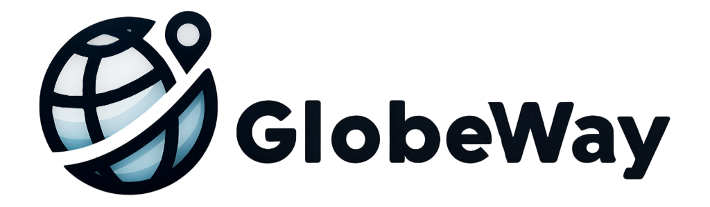
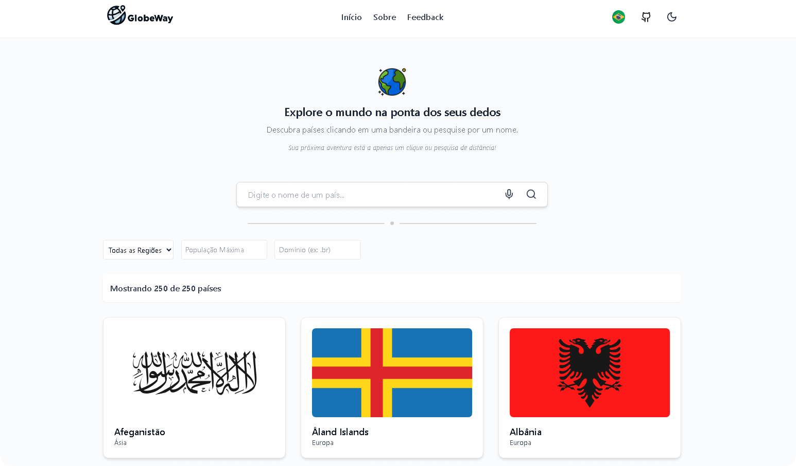

🌍 *[Português](README.md) ∙ [English](README-EN.md)*

<p align="center">
  
</p>

<h1 align="center">GlobeWay - Explore the World</h1>

<div align="center">
  <strong>🌎 Discover countries, explore detailed data, and immerse yourself in global diversity with GlobeWay 🚀</strong>
</div>

---

## 🔭 Overview

**GlobeWay** is an innovative application that provides detailed information about countries worldwide.  
With a modern interface, smart search, and multilingual support, GlobeWay makes exploring the planet more intuitive and accessible.  

<p align="center">
  
</p>

> [!NOTE]  
> **GlobeWay** was created for educational and demonstration purposes.  
> The data displayed is provided by external APIs and may not always be up-to-date.

---

## 🔗 Links

- 🚀 **Live Project**: [Demo](https://globeway-world.netlify.app/)

---

## 💡 Features

✅ **Modern & Responsive Interface**  
- Adaptive design for different devices (desktop, tablet, mobile).  
- Light and dark mode with smooth transitions.  
- Interactive animations with **Framer Motion**.  

🔍 **Smart Search with Suggestions & Voice Recognition**  
- **Autocomplete**: Country suggestions as you type.  
- **Voice Recognition**: Search by speaking the country name!  
- **Smart Correction**: Understands variations of country names.  

📌 **Comprehensive Country Details**  
- **Flag & Coat of Arms**  
- **Official & Common Name translated into the selected language.**  
- **Capital, Population & Land Area**  
- **Continent, Region & Sub-region for better geographic organization.**  
- **Time Zones with differentiation between summer and winter times.**  
- **Languages & Currency**  
- **International Dialing Code & Internet Domain (TLD)**  
- **Traffic Direction (left/right) in the country.**  
- **Start of the week (Sunday or Monday).**  
- **Geographical Coordinates (Latitude & Longitude) with map integration.**  
- **Demonym: Learn how the citizens of the country are called.**  

⚡ **Optimized Performance**  
- **Smart caching** with React Query for fast loading.  
- **Efficient state management** and API calls.  
- **Multilingual support** with i18next.  

---

## 💻 Technologies Used

GlobeWay was developed using the best technologies for performance and user experience:

- **📝 Languages Used**:  
  - 🔷 **TypeScript** – Used for greater security and code quality.  
  - 🟡 **JavaScript** – Some parts of the project still use JavaScript.  

- **Frontend**:  
  - ⚛️ [React.js](https://react.dev/) - Library for building the interface.  
  - ⚡ [Vite](https://vitejs.dev/) - Ultra-fast build tool.  
  - 🎨 [Tailwind CSS](https://tailwindcss.com/) - Modern and responsive styling.  
  - 🎬 [Framer Motion](https://www.framer.com/motion/) - Smooth and interactive animations.  

- **Data & State Management**:  
  - 🔄 [React Query](https://tanstack.com/query/) - API call caching and optimization.  
  - 🌎 [Axios](https://axios-http.com/) - Efficient HTTP requests.  
  - 🌐 [i18next](https://www.i18next.com/) - Multilingual support.  

- **Extra Features**:  
  - 🎙️ **Web Speech** - Voice recognition search.  
  - 🖼️ [Lucide React](https://lucide.dev/) & [MUI Icons](https://mui.com/material-ui/icons/) - Modern and accessible icons.  
  - 🌎 [REST Countries API](https://restcountries.com/) - Data source for country information.  

---

## ⚙️ Environment Setup

To run the project locally in a development environment, make sure you have Node.js and npm (or yarn) installed. Then, follow these steps:

1. Clone the project: 
   ```
   git clone https://github.com/rwbe/globeway
   ```
2. Navigate to the project directory:
   ```
   cd globeway
   ```
3. Install dependencies using npm or yarn:
   ```
   npm install ou yarn install
   ```
4. Start the development server:
   ```
   npm run dev ou yarn dev
   ```
5. Open the application in your browser. By default, it will be available at:
   ```
   http://localhost:5173
   ```

## 🚀 Author

> This project was created by [**Ricardo Willian**](https://github.com/rwbe) as an open-source alternative based on the REST Countries API, allowing intuitive navigation through global data. 

## ⭐️ Support  

If you liked GlobeWay and want to support the project, consider giving it a star on the GitHub repository or sharing it on social media.  
Additionally, contributions are always welcome! If you have suggestions for improvements, bug fixes, or new features, feel free to submit a Pull Request or open an Issue in the repository.  

## 📜 License  

This project is distributed under the [MIT License](LICENSE), allowing free use, modification, and distribution as long as the same license is maintained and the original authors are credited.

---