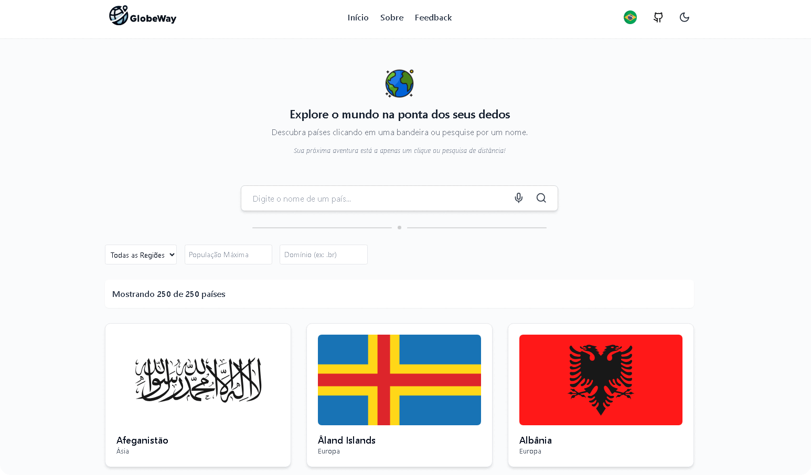

🌍 *[Português](README.md) ∙ [English](README-EN.md)*

<p align="center">
  
</p>

<h1 align="center">GlobeWay - Explore o Mundo</h1>

<div align="center">
  <strong>🌎 Descubra países, explore dados detalhados e mergulhe na diversidade global com GlobeWay 🚀</strong>
</div>

---

## 🔭 Visão Geral

O **GlobeWay** é um aplicativo inovador que fornece informações detalhadas sobre países ao redor do mundo.  
Com uma interface moderna, busca inteligente e suporte a múltiplos idiomas, o GlobeWay torna a exploração do planeta mais intuitiva e acessível.  

<p align="center">
  
</p>

> [!NOTE]
> O **GlobeWay** foi criado para fins educacionais e demonstrativos.  
> Os dados apresentados são fornecidos por APIs externas e podem não estar sempre atualizados.

---

## 🔗 Links 

- 🚀 **Veja o projeto ao vivo**: [Demo](https://globeway-world.netlify.app/)

---

## 💡 Funcionalidades

✅ **Interface Moderna & Responsiva**  
- Design adaptável para diferentes dispositivos **(desktop, tablet, mobile)**.  
- Modo claro e escuro com transições suaves.  
- Animações interativas com **Framer Motion**.  

🔍 **Busca Inteligente com Sugestões & Voz**  
- **Autocompletar**: Sugestões de países enquanto você digita.  
- **Reconhecimento de Voz**: Pesquise falando o nome do país!  
- **Correção Inteligente**: Entende variações do nome dos países.  

📌 **Detalhamento Completo dos Países**  
- **Bandeira & Brasão de Armas**  
- **Nome Oficial & Nome Comum traduzidos para o idioma escolhido.**  
- **Capital, População & Área Territorial**  
- **Continente, Região & Sub-região para melhor organização geográfica.**  
- **Fusos horários com diferenciação entre horários de verão e inverno.**  
- **Idiomas & Moeda**  
- **Código Telefônico Internacional & Domínio de Internet (TLD)** 
- **Domínio de Internet (TLD) para identificar sites oficiais.**   
- **Lado da Direção (direita/esquerda) no trânsito do país.**
- **Data de início da semana (domingo ou segunda-feira).**    
- **Coordenadas Geográficas (Latitude & Longitude) com integração a mapas.** 
- **Gentílico (Demonym) para saber como os cidadãos do país são chamados.** 

⚡ **Desempenho Aprimorado**  
- **Cache inteligente** com React Query para carregamento rápido.  
- **Gerenciamento eficiente de estados** e chamadas à API.  
- **Suporte a múltiplos idiomas** com i18next.  

---

## 💻 Tecnologias Utilizadas

O GlobeWay foi desenvolvido utilizando as melhores tecnologias para performance e experiência do usuário:

- **📝 Linguagens Utilizadas**:  
  - 🔷 **TypeScript** – Utilizado para maior segurança e qualidade do código.  
  - 🟡 **JavaScript** – Algumas partes do projeto ainda utilizam JavaScript.  

- **Frontend**:  
  - ⚛️ [React.js](https://react.dev/) - Biblioteca para construção da interface.  
  - ⚡ [Vite](https://vitejs.dev/) - Ferramenta de build ultrarrápida.  
  - 🎨 [Tailwind CSS](https://tailwindcss.com/) - Estilização moderna e responsiva.  
  - 🎬 [Framer Motion](https://www.framer.com/motion/) - Animações fluidas e interativas.  

- **Gerenciamento de Dados & Estado**:  
  - 🔄 [React Query](https://tanstack.com/query/) - Cache e otimização de chamadas à API.  
  - 🌎 [Axios](https://axios-http.com/) - Requisições HTTP eficientes.  
  - 🌐 [i18next](https://www.i18next.com/) - Suporte a múltiplos idiomas.  

- **Funcionalidades Extras**:  
  - 🎙️ **Web Speech** - Pesquisa por reconhecimento de voz.  
  - 🖼️ [Lucide React](https://lucide.dev/) & [MUI Icons](https://mui.com/material-ui/icons/) - Ícones modernos e acessíveis.  
  - 🌎 [REST Countries API](https://restcountries.com/) - Fonte de dados para informações dos países.  

---

## ⚙️ Configuração do Ambiente 

Para executar o projeto localmente em um ambiente de desenvolvimento, certifique-se de ter o Node.js e o npm (ou yarn) instalados. Em seguida, siga estas etapas:

1. Clone o projeto 
   ```
   git clone https://github.com/rwbe/globeway
   ```
2. Navegue até o diretório do projeto:
   ```
   cd globeway
   ```
3. Instale as dependências usando npm ou yarn:
   ```
   npm install ou yarn install
   ```
4. Inicie o servidor de desenvolvimento:
   ```
   npm run dev ou yarn dev
   ```
5. Abra a aplicação no seu navegador. Por padrão, ela estará disponível em:
   ```
   http://localhost:5173
   ```

## 🚀 Autor

> Este projeto foi criado por [**Ricardo Willian**](https://github.com/rwbe) como uma alternativa open-source baseada na API - REST Countries, permitindo uma navegação intuitiva por dados globais.

## ⭐️ Suporte

Se você gostou do GlobeWay e deseja apoiar o projeto, considere deixar uma estrela no repositório do GitHub ou compartilhar nas redes sociais. Além disso, contribuições são sempre bem-vindas! Se você tem sugestões de melhorias, correções ou novas funcionalidades, sinta-se à vontade para fazer um Pull Request ou abrir uma Issue no repositório.

## 📜 Licença

Este projeto é distribuído sob a [Licença MIT](LICENSE), permitindo uso, modificação e distribuição livremente, desde que mantida a mesma licença e reconhecimento dos autores originais.

---
